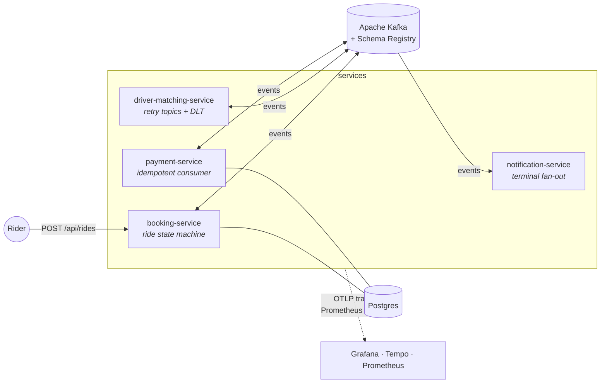
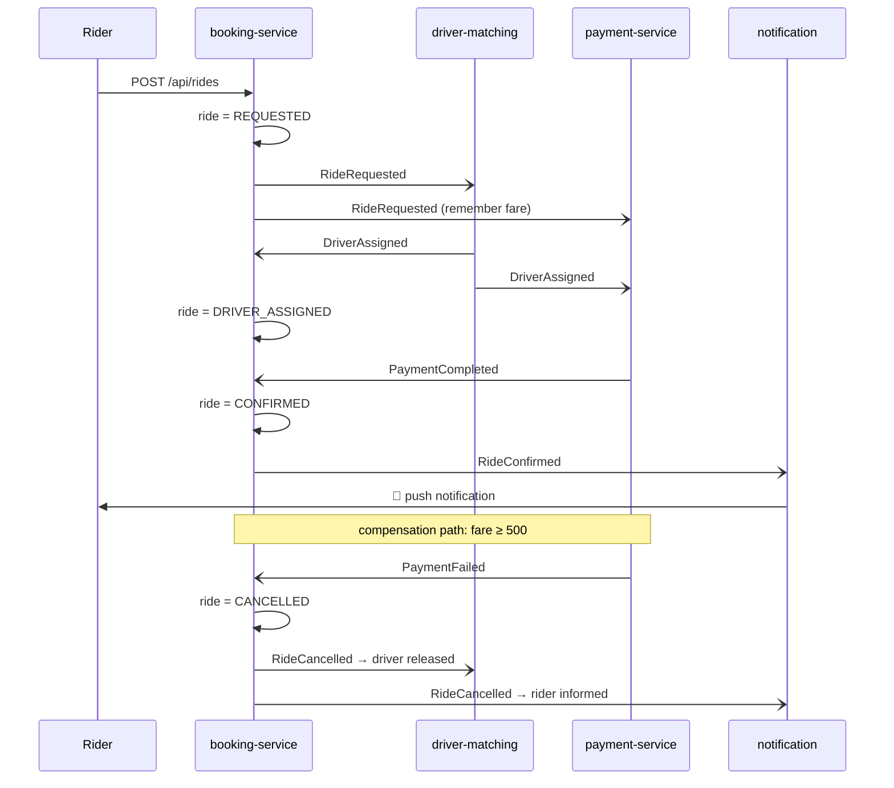

# ride-saga — Event-Driven Microservices Reference

[](https://github.com/messeb/ride-saga/actions/workflows/ci.yml)
[](https://github.com/messeb/ride-saga/actions/workflows/release.yml)
[](LICENSE)
[](https://github.com/messeb?tab=packages&repo_name=ride-saga)

A production-grade reference implementation of **event-driven microservices** on Apache
Kafka: four Kotlin/Spring Boot services coordinate a ride booking through a
**choreographed saga** — no central orchestrator, just events.

Every pattern lives in exactly one clearly documented place, has a test proving it, and
a `make` target demonstrating it live.

## Architecture



### The saga



Services react to each other's events; nobody commands anyone. Compensation is
choreographed too: driver-matching *observes* `RideCancelled` and returns the driver to
the pool ([ADR-001](docs/adr/001-choreography-over-orchestration.md)).

## Quickstart

Prerequisites: JDK 21, Docker with Compose v2, `make`, `curl`, `jq`.

```bash
make up     # builds jars + starts Kafka (KRaft), Schema Registry, Postgres,
            # 4 services, otel-collector, Tempo, Prometheus, Grafana, kafka-ui
make demo   # request a ride, watch the saga run to CONFIRMED
```

| UI | URL |
|---|---|
| booking API | http://localhost:8080 |
| kafka-ui (topics, DLT, consumer groups) | http://localhost:8085 |
| Grafana (dashboard *Ride Saga Overview*, Tempo traces) | http://localhost:3000 |
| Prometheus | http://localhost:9090 |

## Pattern map

| Pattern | Where | Proof |
|---|---|---|
| Choreographed saga + state machine | [`Ride`](services/booking-service/src/main/kotlin/com/messeb/ridesaga/booking/domain/Ride.kt), [`BookingSagaListener`](services/booking-service/src/main/kotlin/com/messeb/ridesaga/booking/messaging/BookingSagaListener.kt) | `make demo`, [ADR-001](docs/adr/001-choreography-over-orchestration.md) |
| Compensation | [`RideCancelledListener`](services/driver-matching-service/src/main/kotlin/com/messeb/ridesaga/dispatch/messaging/RideCancelledListener.kt) | `make demo-payment-failure` |
| Schema contracts + enforced evolution | [`contracts/`](contracts/), [`SchemaCompatibilityTest`](contracts/src/test/kotlin/com/messeb/ridesaga/contracts/SchemaCompatibilityTest.kt) | break a schema → CI goes red, [ADR-002](docs/adr/002-avro-and-schema-registry.md) |
| At-least-once + idempotent consumer | [`PaymentService`](services/payment-service/src/main/kotlin/com/messeb/ridesaga/payment/application/PaymentService.kt) (`processed_events` ledger) | `make demo-duplicate`, [ADR-003](docs/adr/003-at-least-once-and-idempotency.md) |
| Non-blocking retries + DLT | [`RideRequestedListener`](services/driver-matching-service/src/main/kotlin/com/messeb/ridesaga/dispatch/messaging/RideRequestedListener.kt) (`@RetryableTopic`) | `make demo-poison`, [ADR-004](docs/adr/004-retry-topics-and-dlq.md) |
| Correlation & causation ids | [`EventPublisher`](common/src/main/kotlin/com/messeb/ridesaga/common/EventPublisher.kt), [`CorrelationRecordInterceptor`](common/src/main/kotlin/com/messeb/ridesaga/common/CorrelationRecordInterceptor.kt) | `docker compose logs \| grep <corr-id>` |
| Distributed tracing across Kafka hops | Micrometer Tracing → OTel → Tempo | one trace, 4 services, in Grafana ([ADR-006](docs/adr/006-micrometer-otel-bridge.md)) |
| Deliberately absent: outbox, EOS, orchestration | — | [ADR-005](docs/adr/005-no-transactional-outbox.md), [ADR-003](docs/adr/003-at-least-once-and-idempotency.md) |

## Demo walkthroughs

```bash
make demo                  # happy path → CONFIRMED; prints trace + log pointers
make demo-payment-failure  # fare 500 declined → CANCELLED, driver released (compensation)
make demo-poison           # poison message walks retry topics into the DLT (watch kafka-ui)
make demo-duplicate        # offset reset replays events → idempotent consumer skips them
make e2e                   # all of the above, asserted, against a fresh stack
```

## Release pipeline

- **CI** (PRs + main): Gradle build with detekt/ktlint, unit + Testcontainers integration
  tests, the schema-compatibility gate, per-service Dockerfile validation; compose e2e on main.
- **Release** (tag `v*`): tests → multi-arch (`amd64`+`arm64`) images per service pushed to
  `ghcr.io/messeb/ride-saga/<service>` with semver + `latest` tags → GitHub Release with a
  git-cliff changelog from conventional commits.

```bash
docker pull ghcr.io/messeb/ride-saga/booking-service:latest
```

## Repository layout

```
contracts/          Avro event schemas (the system's public API) + compatibility gate
common/             EventPublisher, correlation propagation, shared Kafka wiring
services/           booking · driver-matching · payment · notification
build-logic/        Gradle convention plugins
docker/             compose configs: otel-collector, Tempo, Prometheus, Grafana, initdb
docs/adr/           architecture decision records
docs/events.md      event catalog: topics, ownership, header + evolution rules
scripts/            demo + e2e scripts
```

## Documentation

- [Event catalog](docs/events.md) — topics, conventions, evolution rules
- [ADRs](docs/adr/) — why choreography, Avro, at-least-once, retry topics, no outbox, Micrometer
- [Contributing](CONTRIBUTING.md) — dev setup, conventional commits, schema-change rules

## License

[Apache-2.0](LICENSE) — note: the Confluent Schema Registry components used by the demo
stack are under the Confluent Community License (see [ADR-002](docs/adr/002-avro-and-schema-registry.md)).
